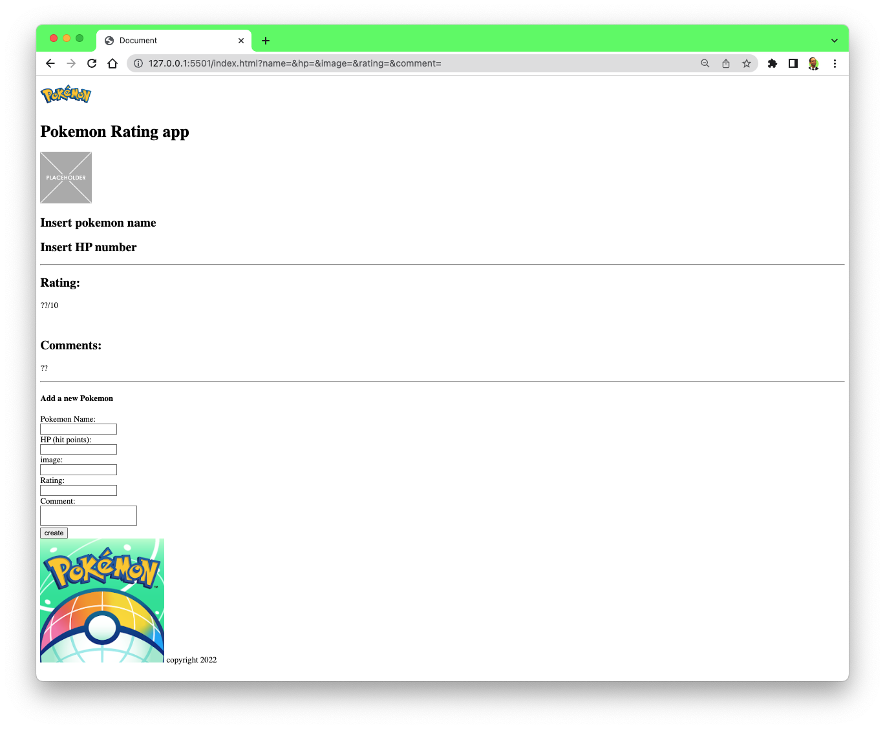
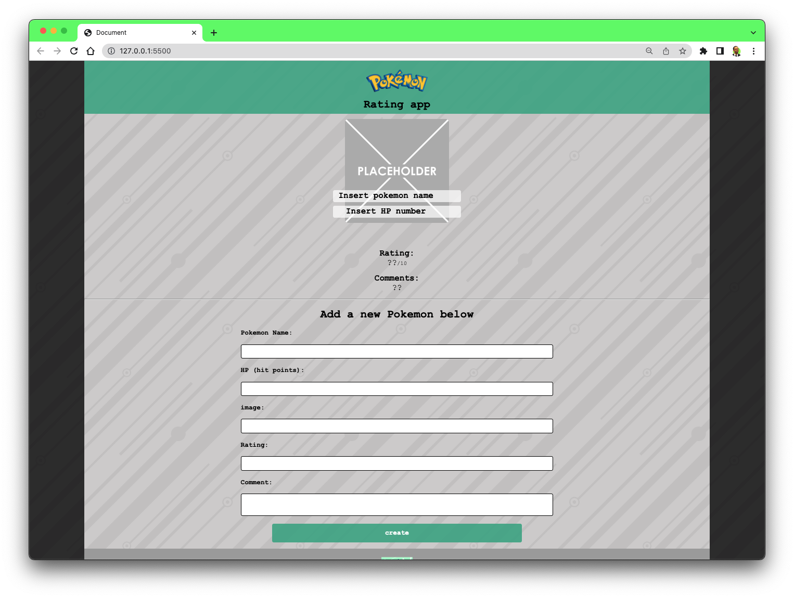

# Pokemon Rating App  

👋 Hey everyone! Welcome to the Web Development Bootcamp.
 
Over the few weeks, we'll be using what we learned from previous lessons on using HTML and CSS and now incorporating Javascript to create a pokemon rating app.

# Learning Goals

- HTML structure
- CSS Styling
- Build our database
- Install npm json-server dependency
- Access information from an API using a GET request
- Update the DOM
- Listen for user events and update the DOM in response

### ⚒️ Tech Stack: HTML, CSS and Javascript

 

# Session 01: App progress

# Session 01: With CSS Styling

### 💡 How to get started

Use the starter code folder to grab the basic HTML, CSS template and get started with building the tasks from Session 01 Readme file.
 
As a reference, you can take a look at the code after the end of each session.
 

### 🚀 Resources

- RadicalX Web Dev Bootcamp for video resources and interacting with the community: [Link Here ➡️](https://www.community.radicalx.co/spaces/8972871/content)
- W3Schools HTML - [Link Here ➡️](https://www.w3schools.com/html/html_intro.asp)
- NPM Json Server - [Link Here ➡️](https://www.npmjs.com/package/json-server)
- MDN Fetch API - [Link Here ➡️](https://developer.mozilla.org/en-US/docs/Web/API/Fetch_API/Using_Fetch)
- MDN JSON Format - [Link Here ➡️](<https://developer.mozilla.org/en-US/docs/Learn/JavaScript/Objects/JSON#:~:text=JavaScript%20Object%20Notation%20(JSON)%20is,page%2C%20or%20vice%20versa>)